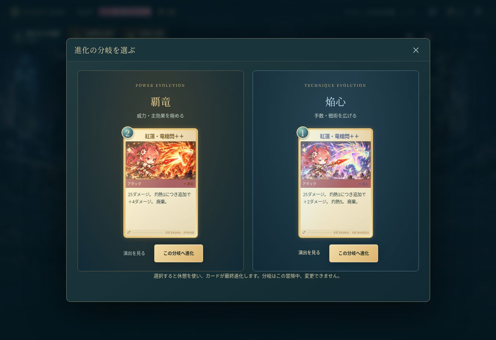

# Bloom Spire — 花灯りの塔

かわいい5人の冒険者と進む、オリジナルのデッキ構築ローグライク。v1.2では分岐進化と、5ステージの先へ続く冒険を追加しました。

## すぐに遊ぶ

ZIPを展開し、`index.html` をChromeまたはEdgeで開いてください。インストール、アカウント、APIキーは不要です。

別途お渡しする **BloomSpire-Play.html** は画像・プログラムを含む1ファイル版です。ダウンロードしてブラウザーで開くだけで遊べます。音楽と効果音はWeb Audioで生成します。

## v1.2の追加内容

- **2段階強化と分岐進化**：通常 → ＋ → 2種類から選ぶ＋＋。威力を伸ばす進化と、手数・戦術を広げる進化を比較できます。
- **分岐ごとの新規イラスト196点**：キャラ別の通常攻撃・防御を含みます。金・紅の力強い進化と、銀・虹色の繊細な進化で、構図・装飾・魔法表現も変化します。
- **進化後の専用演出**：光輪、軌跡、結晶、花弁を追加。15種類の必殺技のカットインも、選んだ分岐に合わせて豪華になります。画面全体は揺れません。
- **キャラ専用レリック10種**：各キャラ2種類。名前、発動回数、条件の進み具合を表示し、クリックすると説明を読めます。ボス報酬には未所持の専用レリックを優先して提示します。
- **ダメージと効果の予測**：カードにカーソルを合わせる／対象を選ぶと、連撃、灼熱、レリック、敵のブロック、ボスの軽減を含む結果を表示します。
- **物語は全5ステージ・60階**。各ボスに異なる攻略ギミックがあります。
- **クリア後の「星巡りの踏破」**：5つの世界を巡り続け、5ステージごとに敵が強化。試練は10段階で、その段階の5ステージをクリアすると次の試練を選べます。
- **衣装と称号**：各キャラ2種類の追加衣装、7種類の称号。最高到達、制覇ステージ数、試練の達成をキャラごとに記録します。

## ゲームの内容

| 内容 | 数・種類 |
| --- | --- |
| 冒険者 | リリィ（開花）、ルーナ（氷結）、ミエル（毒）、フレア（灼熱）、ノエル（連携） |
| 必殺技 | 各キャラ3種類、合計15種類の固有カットインと攻撃演出 |
| カード | プレイ用90種類＋呪い・状態異常2種類 |
| カード絵 | 基本100点＋分岐進化196点。通常攻撃・防御もキャラ別 |
| レリック | 34種類（キャラ専用10種類を含む） |
| ポーション | 4種類、所持枠3個 |
| 敵 | 28種類（エリートと5種類のボスを含む） |
| 旅の要素 | 分岐マップ、3択報酬、ショップ、カード削除、休憩、宝箱、8種類のイベント |
| 難易度 | おさんぽ／冒険／月夜の試練。踏破では試練1〜10を追加 |
| 記録 | 自動保存、JSONの書き出し・読み込み、冒険履歴、衣装と称号 |

## 遊び方

1. 「新しい冒険」でキャラ、最初の必殺技、難易度を選びます。「演出を見る」で各必殺技をプレビューできます。
2. マップの光っている場所を選びます。線でつながる次の階へ進みます。
3. 攻撃カードを選んで敵を選択します。防御や自己強化はカードをクリックするだけで使えます。PCでは攻撃カードを敵へドラッグしても使えます。
4. 基本3エナジーの範囲でカードを使い、「ターン終了」で敵の行動へ進みます。頭上の行動予告と、ボス固有ルールの表示が攻略の手がかりです。
5. 勝利後は3枚から1枚を追加できます。追加せず進むこともできます。
6. 休憩では回復か強化。**＋のカードをもう一度磨くと2つの分岐を比較し、演出を見て選べます。** 分岐はその冒険中は変更できません。最終進化したカードはそれ以上強化できません。
7. 各ステージ12階のボスを倒し、ステージ5のクリアを目指しましょう。

カード図鑑やデッキのカードを押すと、通常・＋・両方の進化先の性能とイラストを比較できます。スマートフォンでは手札を横にスワイプし、画面は縦にスクロールできます。

### ボスの攻略

| ステージ | 世界 | 固有ギミック |
| --- | --- | --- |
| 1 | こもれびの森 | 花弁結界：毎ターン最初の3ヒットを半減。連撃で削るか、毒で無視できます。 |
| 2 | 月鏡の庭 | 月の詠唱：3ターンごとの大魔法を、詠唱ターンのスキル2枚で中断できます。 |
| 3 | 星咲きの塔 | 星の護衛：護衛が生きている間、本体への直接ダメージを半減します。 |
| 4 | 極光の天城 | 嵐の溜め：溜め中に本体へ3ヒットを当てると、大技を中断できます。 |
| 5 | 暁の聖域 | 日輪／月輪：日輪は各ヒットを6軽減。月輪はアタック3枚で大技の基礎威力が14下がります。 |

### クリア後の解放

| 条件 | 解放内容 |
| --- | --- |
| いずれかのキャラで物語5ステージをクリア | 全キャラで星巡りの踏破を選択可能 |
| そのキャラで物語5ステージをクリア | そのキャラの「星祭りの礼装」 |
| そのキャラで踏破5ステージをクリア | そのキャラの「暁の継承者」 |
| 試練Nで踏破5ステージをクリア | 次の試練N＋1（最大10） |
| 物語・踏破・試練をさらに攻略 | 衣装と称号画面に表示された条件で称号を獲得 |

踏破のボス報酬では次へ進むほか、「記録を残して帰還」も選べます。衣装と称号はタイトル画面やキャラ選択から変更でき、次の冒険へ反映されます。衣装は探索・戦闘の立ち絵を変更し、能力は変わりません。

### 主なルール

- 毎ターン、基本3エナジーを回復して5枚引きます。手札上限は10枚です。
- ブロックは次の自分のターン開始時に消えます。「とこしえの庭」で保持できます。
- 開花・筋力はアタックの各ヒットを強化し、敏捷性はカードで得るブロックを増やします。
- 氷結は敵の各ヒットを弱め、敵の行動後に1減ります。
- 毒は敵の行動前にブロックとボスの直接攻撃軽減を無視してダメージを与え、その後1減ります。
- 脱力は攻撃ダメージを25%減らし、無防備は受ける攻撃ダメージを50%増やします。
- 灼熱はアタックの各ヒットを強化し、アタック1枚につき1減ります。灼熱倍率を持つ技には追加で乗ります。
- 連携はそのターンにすでに使ったカード枚数です。
- 最初に選んだ必殺技は、デッキにある限り毎戦闘の最初の手札に入ります。他の必殺技は報酬やショップで獲得できます。
- 廃棄カードはその戦闘では戻りません。次の戦闘ではデッキに戻ります。パワーは使用後に廃棄され、効果はその戦闘中続きます。
- ボス後に次のステージへ進むと、最大HPの40%を回復します。

### キー操作

| 操作 | キー |
| --- | --- |
| 手札を選択 | 1〜9 |
| 対象選択をキャンセル／演出をスキップ | Esc |
| 敵が1体のとき、選択カードで攻撃 | Enter |
| ターン終了 | Space |
| デッキ | D |
| マップ | M |

設定でアニメーション・音楽・効果音を切り替えられます。端末の「動きを減らす」にも対応します。

## GitHub Pagesで公開する

ビルド不要の静的ゲームです。相対パスを使っているため、リポジトリ名を変更しても動作します。

1. GitHubで公開用リポジトリを作成します。
2. **ZIPの中身を展開して、すべてリポジトリ直下へアップロード**します。`index.html` が直下、画像が `assets/` にある構成にします。
3. **Settings → Pages → Source: Deploy from a branch** を選びます。
4. **Branch: main、Folder: /(root)** を選んで **Save**。
5. 公開が完了するとPages画面にゲームのURLが表示されます。

ZIPそのものをアップロードするだけでは遊べません。`assets` の名前や階層を変えないでください。

公開設定の確認元：[GitHub公式：公開元を設定する](https://docs.github.com/en/pages/getting-started-with-github-pages/configuring-a-publishing-source-for-your-github-pages-site)（2026-09-24確認）。

## セーブと旧版からの移行

冒険・設定・戦績・衣装と称号はブラウザー内に保存します。各操作後に自動保存され、戦闘途中から再開できます。演出中も行動結果は保存済みです。

v1.0／v1.1の記録も読み込めます。旧版の3ステージクリアは3ステージの実績として保持し、5ステージクリアの解放とは区別します。冒険中の旧セーブはそのまま進められます。

設定の「冒険の記録を書き出す」でJSONを保存し、移行先で「記録を読み込む」を使ってください。解放済みの衣装・称号の実績も含みます。異なる端末、ファイル版と公開版では保存先が異なるため、書き出して移行してください。ブラウザーのデータ削除やプライベートモードでは記録が残らない場合があります。

## 改造する

| ファイル | 役割 |
| --- | --- |
| `index.html` | 起動ページ |
| `style.css` | 画面、レスポンシブ対応、演出 |
| `data.js` | 基本カード・敵・レリック・イベント |
| `expansion-data.js` | 分岐進化、専用レリック、ステージ4・5 |
| `engine.js` | 戦闘、予測、マップ、報酬、保存データ |
| `progression.js` | 踏破記録、試練、衣装、称号の解放 |
| `atlas-layout.js` | 画像内の表示領域 |
| `card-art.js` | キャラ・技・分岐ごとのカード絵の対応 |
| `battle-fx.js` | 必殺技、進化演出、粒子、演出の後片付け |
| `app.js` | 画面表示、操作、音、ローカル保存 |
| `assets/` | 背景・キャラ・敵・カードの画像 |
| `tests/` | ゲーム進行・戦闘・互換性・解放条件のテスト |
| `server.cjs` | 任意のローカル確認用サーバー |
| `tools/build-standalone.py` | 1ファイル版の生成 |

Node.jsがある場合、`npm test` でテスト、`npm run dev` で確認用サーバーを起動できます。npmパッケージのインストールは不要です。`python3 tools/build-standalone.py` で1ファイル版を再生成できます。

ゲームは外部CDN、フォント配信、API、解析スクリプトを使用しません。

## 確認範囲

32件の自動テストで、全カードの分岐、専用レリック10種、5ボスのギミック、予測と実ダメージの一致、踏破7ステージの継続、段階解放、旧セーブ互換を確認しています。Chromiumで分岐選択・保存後の再開・衣装と称号の解放・ボス戦・演出を確認し、390px幅でも表示を確認しました。スマートフォン実機での操作感は未確認です。
